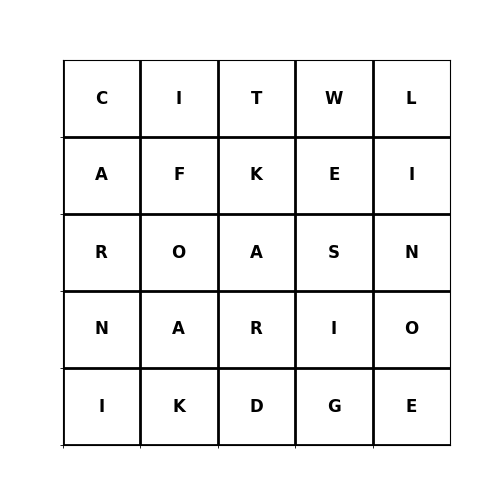

# [Jane Street June 2024 Puzzle](https://www.janestreet.com/puzzles/altered-states-2-index/)

## Altered States 2

DFS brute force for an adequate solution + some trial-and-error optimisation.

Score: 196,587,172
States (20):

- CALIFORNIA - 39,538,223
- TEXAS - 29,145,505
- FLORIDA - 21,538,187
- NEWYORK - 20,201,249
- ILLINOIS - 12,812,508
- OHIO - 11,799,448
- GEORGIA - 10,711,908
- VIRGINIA - 8,631,393
- ARIZONA - 7,151,502
- INDIANA - 6,785,528
- WISCONSIN - 5,893,718
- OREGON - 4,237,256
- IOWA - 3,190,369
- NEVADA - 3,104,614
- ARKANSAS - 3,011,524
- KANSAS - 2,937,880
- NEBRASKA - 1,961,504
- IDAHO - 1,839,106
- MAINE - 1,362,359
- ALASKA - 733,391

